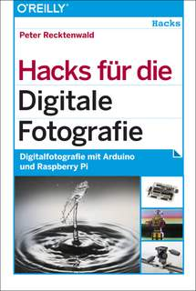

#Hacks für die Digital Fotografie

Digitalfotografie mit Arduino, Raspberry Pi & Co.

Erschienen im O'Reilly Verlag 2014

ISBN 3955616444

http://www.oreilly.de/catalog/digfotografiehacksger/

Begleitender Quellcode zum gleichnamigen Buch von Peter Recktenwald. 

* [Arduino Quellen und Bibliothek](Arduino)
* [Java Quellen](Java)
* [Fritzing Schaltpläne](Fritzing)

